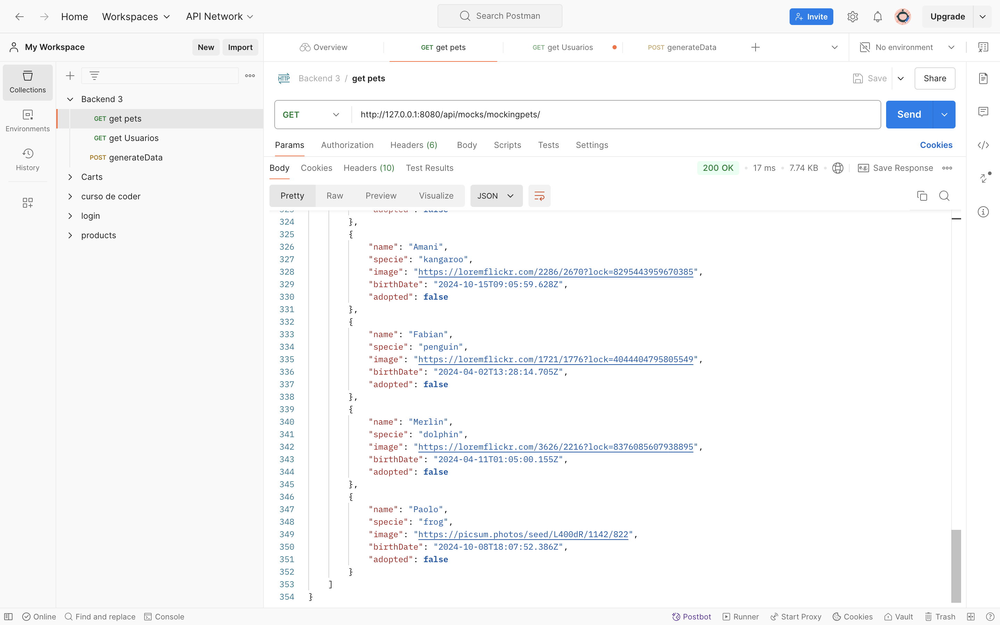
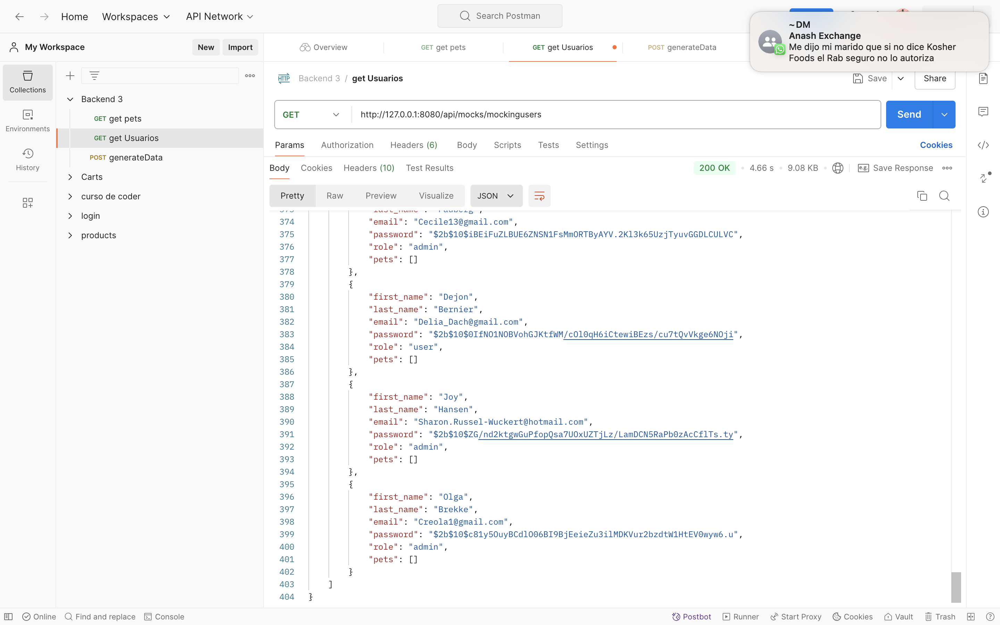
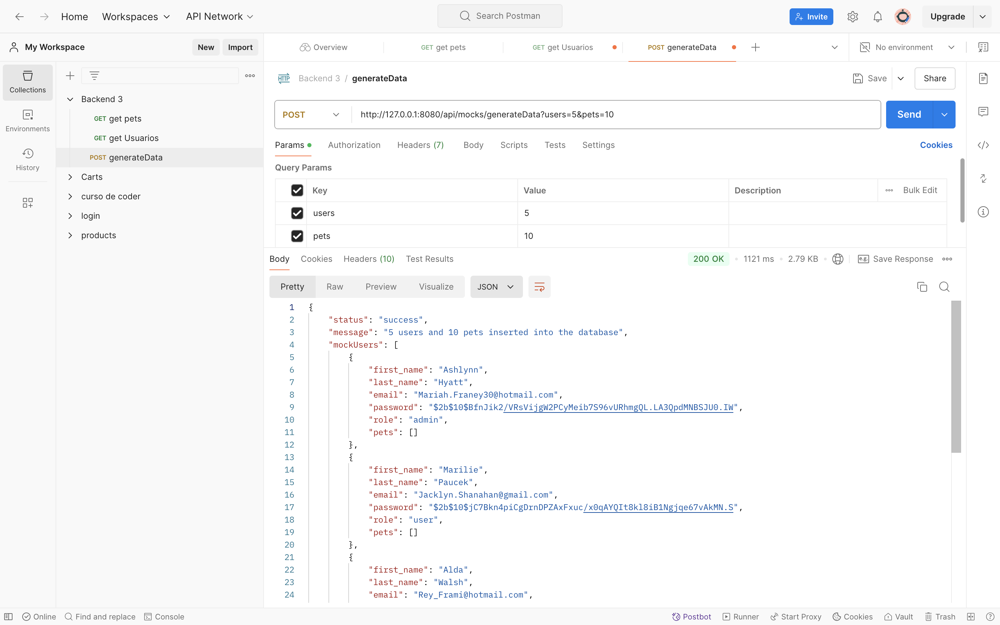

# BACKEND 3
## Proyecto de generación de mock data para usuarios y mascotas
Este proyecto facilita la creación de datos ficticios para las colecciones de usuarios y mascotas, empleando la biblioteca Faker. Los datos generados se cargan masivamente en la base de datos de pruebas, lo que permite realizar tests con datos simulados y evita el uso de información real en el entorno de desarrollo.

## Requisitos Previos
- Node.js y npm instalados.
- MongoDB (URI configurada en un archivo .env para la conexión a la base de datos). Ver env.example.

_____________________________________________________________________________________________________

## Como instalar?
1. Clonar el repositorio:
`https://github.com/micaelachayo/backend3.git`

2. Instalar las dependencias:
     `npm install `

3. Crear archivo .env en la raíz del proyecto con la URI de conexión a MongoDB. Ver archivo env.example

4. Ejecutar el proyecto:
    `npm run dev`
_______________________________________________________________________________________________________
# API de Mocking

## Consideraciones
Para probar los endpoints, ten en cuenta que la configuración de red puede variar según tu computadora.  
Si no funciona con `127.0.0.1`, utiliza `localhost`.

---

## Endpoints

### 1. Mocking Pets
**URL:** [http://127.0.0.1:8080/api/mocks/mockingpets](http://127.0.0.1:8080/api/mocks/mockingpets)  
**Descripción:** Genera y devuelve una lista de 50 mascotas ficticias sin insertarlas en la base de datos.

---

### 2. Mocking Users
**URL:** [http://127.0.0.1:8080/api/mocks/mockingusers](http://127.0.0.1:8080/api/mocks/mockingusers)  
**Descripción:** Genera y devuelve una lista de 50 usuarios ficticios sin insertarlos en la base de datos.

---

### 3. Generate Data
**URL:** [http://127.0.0.1:8080/api/mocks/generateData?users=10&pets=5](http://127.0.0.1:8080/api/mocks/generateData?users=10&pets=5)  
**Descripción:** Genera e inserta datos de prueba en la base de datos.  

**Parámetros de la URL:**
- **users** (opcional): Número de usuarios a generar (valor predeterminado: 50).
- **pets** (opcional): Número de mascotas a generar (valor predeterminado: 50).

**Ejemplo de uso:**  
`/api/mocks/generateData?users=10&pets=10` generará 10 usuarios y 10 mascotas.

